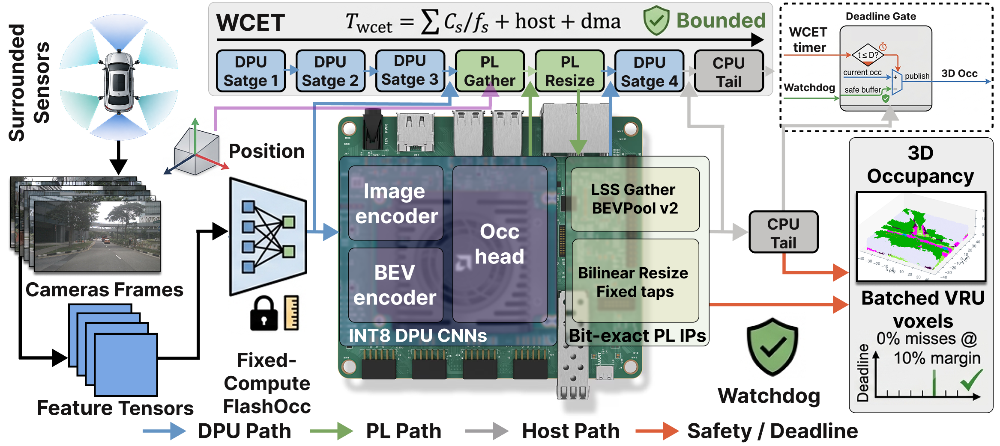
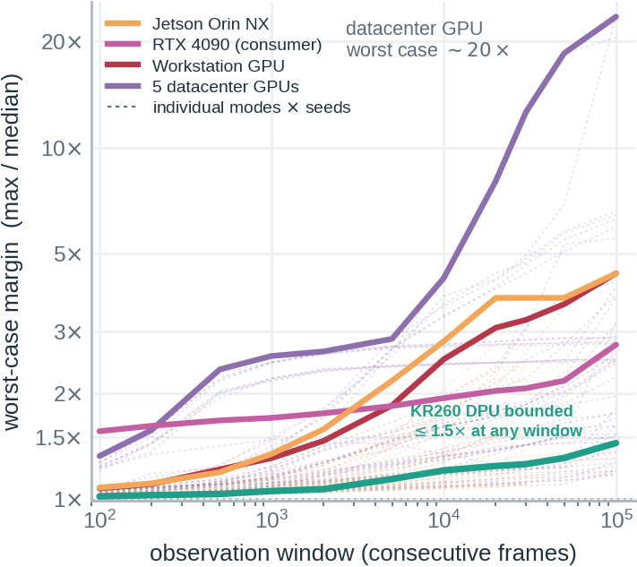
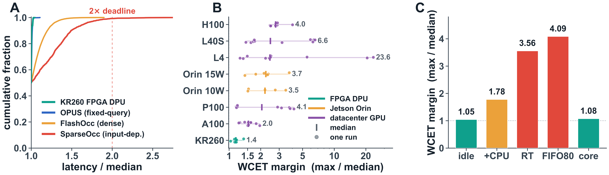
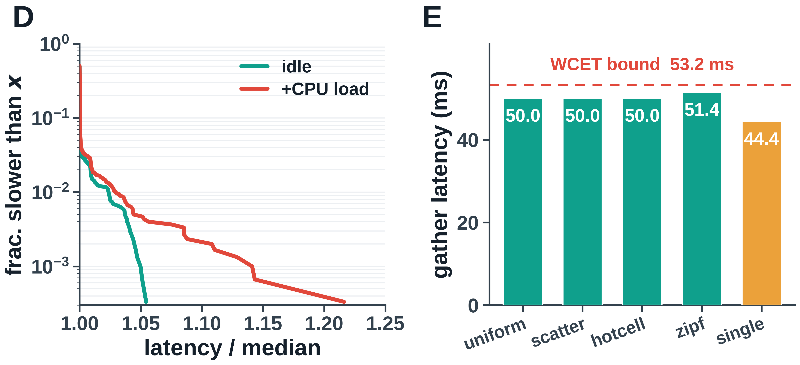
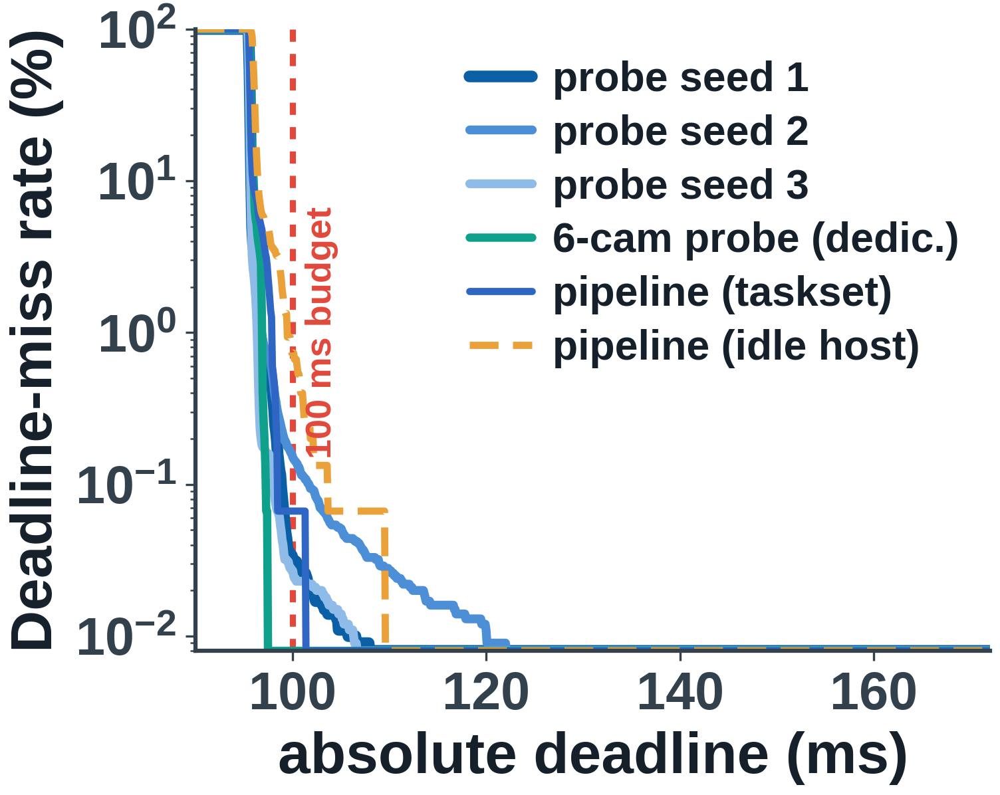
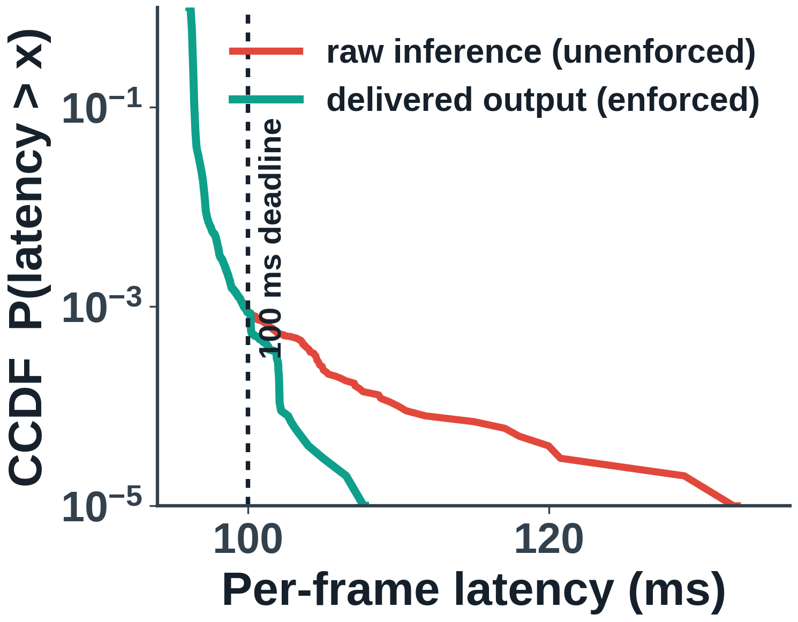
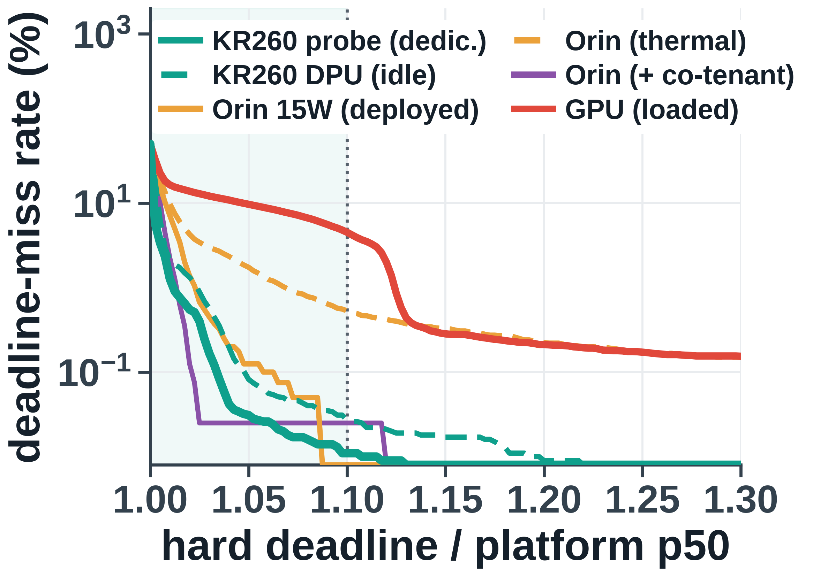
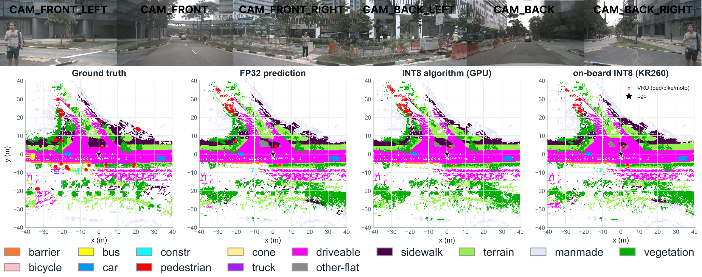

# FALCON: FPGA-Accelerated Latency-Certifiable Occupancy Networks

Anonymous code and data release for **WACV 2027 submission #1253**.

A perception system that must brake for a pedestrian does not need a low average latency: it must
deliver an answer before the deadline on **every** frame, the worst case included. FALCON deploys a
camera-based 3D occupancy network (FlashOcc) on the AMD Kria KR260 embedded FPGA (4.3 to 6.6 W) with a
**layered latency guarantee**: programmable-logic compute is cycle-bounded analytically, inference is a
measured envelope over 100k-frame traces, and output delivery is structurally guaranteed by an enforced
watchdog.



## Headline results

| Axis | Result |
|---|---|
| Accuracy (full Occ3D-nuScenes val, 6019 frames) | on-board mIoU **29.88** = 92.8% of an FP32 baseline the DPU cannot run; matched INT8 reference 31.43 |
| Latency tail (100k-frame probe) | KR260 stays within **2.0×** its median; Jetson Orin NX reaches 4.4×, datacenter GPUs 23.6× |
| Enforced delivery (3 × 100k frames) | raw miss rates span tenfold (0.070 to 0.671%), yet **every one of 300k frames** delivered within deadline + 10.2 ms worst |
| Custom PL IPs | gather 4.7 ms / resize 3.44 ms compute WCET, cycle-bounded, numerically matched to CUDA / torch references |
| Power (INA260, measured) | 4.33 W idle, 5.8 to 6.6 W under inference, 8.7 W peak |

### Tail ratio versus observation window

GPU latency can be measured but not bounded: tails keep growing as the window lengthens, while the
KR260 datapath stays flat because accelerator work is fixed by cycle count.



### Latency determinability decomposes into three legs

Model architecture (input-dependent work, not sparsity, drives tails), platform sharing (seeds,
co-tenants, thermal), and host path (core dedication beats real-time priority).





### Deadline behavior at 100k-frame scale

Absolute 100 ms budget, enforced delivery CCDF, and relative margin over each platform's median.

<p>



</p>

### Qualitative deployment output

Ground truth, FP32, GPU INT8, and on-board KR260 INT8: the board tracks the INT8 reference and
preserves visible VRU structure.



## Repository layout

| Path | Contents |
|---|---|
| `fpga/hls/` | Custom PL IPs: LSS view-transform **gather** and BEV-neck **bilinear resize** (Vitis HLS sources + C/RTL testbenches; fixed trip counts, INT16 datapath) |
| `fpga/quant/` | DPU INT8 recipe: calibration-time activation clipping (C=32), reference-ladder evaluation, board-vs-simulation comparison, VRU recall, fallback pricing |
| `fpga/board/` | On-board runners: DPU submission, enforced-watchdog delivery layer, head-on-DPU prototype (1×1-conv subgraphs + int8-LUT softplus) |
| `plots/` | Figure generators; every paper figure regenerates from `traces/` |
| `traces/` | Raw timing traces: 100k-frame probe and pipeline runs (KR260, Jetson Orin NX, workstation and datacenter GPUs), enforced-delivery runs, deadline tables (CSV/NPY) |
| `tools/` | Helper scripts |

## Reproducing the paper figures

```bash
pip install numpy matplotlib pillow
python plots/make_window_margin_fig.py      # Fig. 1
python plots/make_determinism_panel.py      # Fig. 4a-c
python plots/make_ip_determinism.py         # Fig. 4d-e
python plots/make_deadline_absolute.py      # Fig. 6a
python plots/make_delivery_timeline.py      # Fig. 6b
python plots/make_deadline_payoff.py        # Fig. 6c
```

Each script reads `traces/` relative to the repo root and writes PNG/PDF.

## Trace format

100k-frame runs are single `float64` NPY arrays of per-frame host-visible latency in milliseconds
(one warmup frame excluded). Enforced runs additionally log delivery timestamps and fallback flags.
Deadline tables (`traces/deadline_*.csv`) carry per-platform p50, max/p50, CV, and miss rates at
fixed margins.

## Board environment

KR260 (K26 SOM, B4096 DPU), Ubuntu 22.04, XRT 2.13.0, Vitis AI 2.5/3.0, PYNQ-DPU.
HLS IPs close timing at 200 MHz post-route; the unified bitstream carries the DPU and both resize
IP instances (+0.15 ns slack at 65% LUT, 59% FF, 69% BRAM, 83% DSP).

## License

MIT (see `LICENSE`). Anonymous release for double-blind review.
